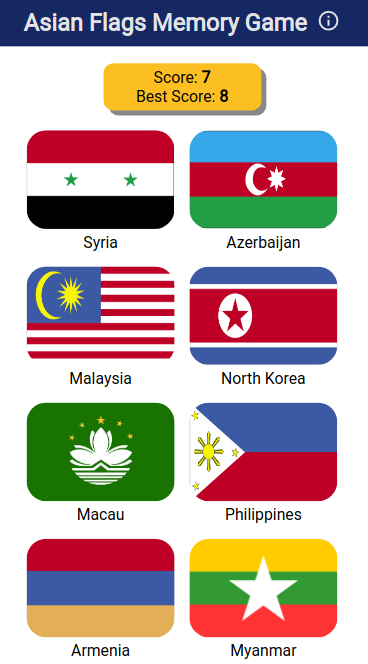

# Memory Card game

A basic memory card game featuring Asian flags. The objective of the game is for the user to click as many flags as they can, but each flag can only be clicked once. The game restarts when the user clicks a flag more than once. All flags are shuffled every time a flag is clicked.

# Features
* Showing of current and best score
* Mobile friendly design

# Built with
* HTML
* CSS
* JavaScript
* React (React Hooks and States)

See live demo [here](https://letsgo12300.github.io/memory-game/).